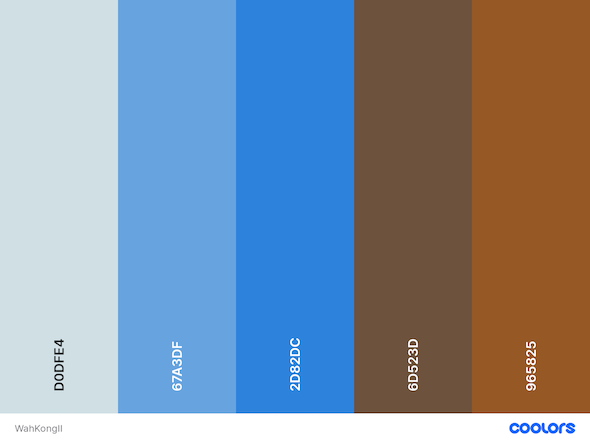

# Wah Kong II Website

The website completed and presented for Milestone Project 1 is intended to showcase Wah Kong II, a classic wooden yacht based in Weymouth, UK. It has been designed and developed using a mobile-first approach, and is accessible and responsive across a range of devices.


[Visit the deployed site for Wah Kong II](https://mikiburgess.github.io/MP1-Wah-Kong/index.html)

- - -

## Table of Contents

- [Introduction](#Introduction)
- [User Experience (UX)](#User-Experience-(UX))
    - [User Stories](#User-Stories)
    - [Site Elements](#Site-Elements)
- [Site Design](#Site-Design)
    - [Wireframes](#Wireframes)
    - [Fonts](#Fonts)
    - [Color Scheme](#Color-Scheme)
    - [Images](#Images)
    - [Videos](#Videos)
- [Site Features](#Site-Features)
    - [Current Features](#Current-Features)
    - [Future Features](#Future-Features)
-  [Development Process](#Development-Process)
    - [Tools](#Tools)
    - [Project Management](#Project-Management)
    - [Languages](#Languages)
    - [Frameworks](#Frameworks)
- [Testing](#Testing)
- [Bugs](#Bugs)
    - [Fixed Bugs](#Fixed-Bugs)
    - [Unfixed Bugs](#Unfixed-Bugs)
- [Deployment](#Deployment)
- [Future Development](#Future-Development)
- [Credits](#Credits)
    - [Content](#Content)
    - [Code](#Code)
    - [Learning Resources](#Learning-Resources)
    - [Acknowledgements](#Acknowledgements)

- - -

## Introduction

## User Experience (UX)
This website showcases Wah Kong II, a classic wooden yacht currently moored in Weymouth, UK. Originally built in 1958, due to her age and construction she is of potential interest to the classic boat community.
She's been with her current owner since 2004, but at some point in the future she may need to be sold to a new owner. After discussion with the current owner it was decided that a website would be useful for communicating with various sailing communities, 
such as the classic boat community, and assist in her sale at some undefined point in the future.

From this initial discussion with the yacht's owner, a number of potential users and user stories were identified.

### User Stories
Three categories of users were identified:
- General site visitors,
- Visitors with specific interest in the yacht,
- Yacht owner (the primary customer for this web site).

##### GENERAL USERS
First time visitor to the site:
- As a First Time Visitor, I want to be able to navigate through the site easily and intuitively, to browse and locate the content.
- As a First Time Visitor, I want to be able to contact the owner with comments and/or to ask questions.
- As a First Time Visitor, I want to be able to where the organisation is located.

Returning visitors to the site:
- As a Returning Visitor, I want to be able to navigate the site quickly and easily in order to find the information I'm looking for.
- As a Returning Visitor, I want to be able to contact the owner with comments and/or to ask questions.

##### SPECIFIC USERS
Individuals with a personal interest in classic boats, such as other classic boat owners: 
- As a Site Visitor, I want to be able to see photos and read about the history and construction in order to learn more about her.

Individuals/companies interested in booking attendance at an event/regatta: 
- As an Event Organiser, I want to quickly and easily get an an overview of the history and build of the boat so that I can determine whether it's right for the event.

Companies looking for a classic boat for hire (TV/Film/Photography):
- As a Filmmaker/Photographer, I want to be able to see a variety of images so that I can determine whether the yacht may be a suitable candidate for the production and therefore worth reviewing on site.

Potential new owner: 
- As a Potential New Owner, I want to read about the specifications, construction and history, be able to view photos of various elements of the the yacht, so that I can determine whether she may be suitable for me therefore worth reviewing on site.

##### YACHT OWNER
- As the Owner, I want to be able to showcase my yacht so that anyone interested in her (national and international) can find out more and contact me directly.
- As the Owner, I want to advertise the yacht for potential commercial work, in order to raise fund for her maintenance.
- As the Owner, I want to be able to inform potential buyers of her details so that, in the future, I will be able to sell her to a classic yacht enthusiast.

### Site Elements
Considering the above user stories and the milestone 1 project requirements, the following elements to be included in the site were identified:
- Overview of dimensions, construction and history
- Gallery showcasing the yacht herself and views from the yacht whilst at sea.
- Enquiry form for site visitors to request information regarding features/history, bookings and/or availability.
Plus, if time allows post-mvp (minimal viable product):
- Overview of her appearance in the movie ['On Chesil Beach'](https://www.imdb.com/title/tt1667321/)

- - -

## Site Design

### Wireframes
Wireframes were designed after the initial discussion with the yacht owner, reviewed with them during a second discussion in order to gather their feedback, then revised. The revision included adding a map to the contact page, showing the location. The final set of wireframes used for development are listed below:  
- [General page design](docs/wireframes/general_design.png) - the foundation for developing all site wireframes
- [Home Page (index.html)](docs/wireframes/p1_index.png)
- [Photo Gallery (gallery.html)](docs/wireframes/p2_gallery.png)
- [Contact Page (contact.html)](docs/wireframes/p3_contact.png)
- [Filming Page (filming.html; additional site page)](docs/wireframes/p4_extra_filming.png)

### Fonts
- [Fontpair](https://www.fontpair.co/) was used to identify complementary font pairs for use across the site. The pair selected for use on this site - [Karla & Merriweather](https://www.fontpair.co/pairings/karla-merriweather) 
- Addiitonal site icons were obtained from [Fontawesome](https://fontawesome.com/). [Version 5](https://fontawesome.com/v5/search?o=r&m=free) was adopted due to being the version used in the Code Institute course. Future development however would involve upgrading this to the latest version.

### Color Scheme
The color scheme for the site was taken from the colors of Wah Kong near her mooring, using a photo including her deck, mast and cabin, the sea, and a clear blue sky. The photo was uploaded to the [Coolors](https://coolors.co/user/palettes) color palette creation tool, resulting in the following site color palette:



These colors were added as variables to the stylesheet to allow for easy reuse throughout the project:

``` 
{
    --wavesblue: rgba(208, 223, 228, .9);
    --wavesblue-light: rgba(208, 223, 228, .2);
    --skyblue: #67A3DF;
    --coverblue: #2D82DC;
    --mastbrown:#6D523D; 
    --cockpitbrown: #965825;
}
```

### Site Content
- The site will primarily comprise photographs, plus one video, taken by myself and the yacht owner. 
- The text will be written by me, based on infomraiton provided by the yacht owner.
- Movie trailer for 'On Chesil Beech' will be embedded from [YouTube](https://youtu.be/ZR6DWDfMDlM).
- The site icon of an Anchor was created on [Favicon](https://www.favicon.cc/?action=icon&file_id=996800), where it was both downloaded for project and shared online for others to use. 


## Site Features
### Current Features
*(note:check requirements 3.2)*

### Future Features
- Incorporate [modal images](https://www.w3schools.com/howto/howto_css_modals.asp) into the photo gallery, allowing full size viewing of each gallery photo. 
- Add backend functionality to process submitted contact form data and respond accordingly, rather than using Code institute's form submission checker.
- Add a page of resources, including links to the marina, yacht club, and local boat yard.

In adition, if additional images are required,  royalty-free images will be obtained from [Pixabay](https://pixabay.com/). Those selected would be usable under their [Content Licence](https://pixabay.com/service/terms/) (Section 4) or licenced under the Creative [Commons Zero licence](https://pixabay.com/service/terms/) (Section 3).

- - -

##  Development Process
### Tools
### Project Management
### Languages
### Frameworks

## Testing
Results of site testing can be found in [TESTING.MD](docs/testing/TESTING.MD).

## Deployment

## Future Development

- - -

## Credits
I would like to credit the following resources and individuals for supporting both my learning and the development of this project.

### Content
- Yacht history, data and images were supplied by Martin Burgess, skipper and current owner of Wah Kong II.
- Additional images and video were taken from my personal library.
- Movie trailer video embedded from [YouTube](https://www.youtube.com/).


### Additional code
- [Bootstrap v4.5](https://getbootstrap.com/) framework in site styling.
- The fonts used in this project are from [Google](https://fonts.google.com/) and [Fontawesome](https://fontawesome.com/). 


### Learning Resources
Additional learning resources (*alongside Code Institute*):
- [Balsamiq Documentation](https://balsamiq.com/wireframes/desktop/docs/symbols/#importing-symbols-from-wireframes-to-go): learning how to use Balsamiq to develop Wireframes during gthe design stage,
- [Bootstrap v4.5 Documentation](https://getbootstrap.com/docs/4.5/getting-started/introduction/): Building upon the learning undertaken during the course to improve my knowledge and understanding of this framework.
- [W3Schools](https://www.w3schools.com/): Specifically the reference pages for [CSS](https://www.w3schools.com/css/default.asp) and [Bootstrap](https://www.w3schools.com/bootstrap4/default.asp), and their [Accessibility Guidelines](https://www.w3schools.com/accessibility/index.php).
- [Medium.com](https://medium.com/): Specifically for the article ['Best Practices on aria-label, aria-labelledby and aria-describedby'](https://medium.com/accessibility-a11y/best-practices-on-aria-label-aria-labelledby-and-aria-describedby-913fc9e396ae) by Saptarshi Katwala.
- [The Net Ninja on YouTube](https://www.youtube.com/playlist?list=PL4cUxeGkcC9goXbgTDQ0n_4TBzOO0ocPR): Git & GitHub Tutorial for Beginners.
- []()

To create the project README.MD and TESTING.MD files I was inspired by the following: 
- A Code Institute alumni, [Kera Cudmore's](https://github.com/kera-cudmore) GitHub repository includes examples and advice for creating these documents for [milestone project 1](https://github.com/kera-cudmore/readme-examples/blob/main/milestone1-readme.md), plus an example completed repo for [Bully Book Club](https://github.com/kera-cudmore/Bully-Book-Club) website.
- []()

### Acknowledgements
I would like to acknowledge the following people who helped me complete this milestone project:
- [Iris Smok](https://github.com/Iris-Smok) - our Code Institute cohort facilitator, for being a constant source of support and encouragement.
- [Jubril Akolade](https://github.com/Jubrillionaire) - my Code Institute mentor, for their invaluable feedback and suggestions during the development of this project.
- Martin Burgess - owner and skipper of Wah Kong II, for providing images, yacht data, and feedback during the development process.
- Dr Nic Caine - professional softweare developer, for providing additional feedback during the development process.

- - -
