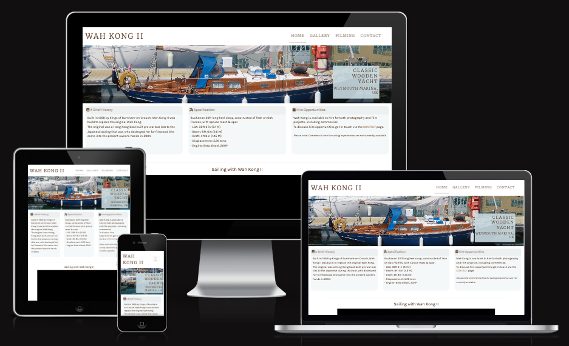

# Wah Kong II Website

Overview of the testing of Milestone Project 1 - Website for yacht Wah Kong II.



[Visit the deployed site for Wah Kong II](https://mikiburgess.github.io/MP1-Wah-Kong/index.html)

- - -

## Table of Contents

- [Introduction](#introduction)
- [Responsiveness](#responsiveness)
- [Browser Compatability](#browser-compatbility)
- [Code Validation](#Code-Validation)
- [Lighthouse](#Lighthouse)
- User Story Testing (inc able: 'User Story' and 'Testing' columns)
- Features (manually test all features. again inc table)
- [Bugs](#Bugs)
    - [Fixed Bugs](#Fixed-Bugs)
    - [Unfixed Bugs](#Unfixed-Bugs)


- - -

## Introduction
This document describes the testing process and results for Milestone Project 1. For additional project details please refer to:
- [Main project README document](../../README.MD)
- [Deployed web site](https://mikiburgess.github.io/MP1-Wah-Kong/)

## Responsiveness
(inc screenshots and poss video. test each page. inc summary table)


| Responsiveness | Android Mobile | Apple Mobile | Android Tablet Device | Apple Tablet Device | Desktop 1024px | Desktop >1200px | Notes | Evidence |
| ----------- | ----------- | ----------- | ----------- | ----------- | ----------- | ----------- | ----------- | ----------- |
| Site is responsive >=700px | n/a | n/a |  |  |  |  | Notes | |
| Site is responsive <699px |  |  | n/a | n/a | n/a | n/a | Notes | |
| Text Readable | Good | Good | Good | Good | Good | Good | No readability issues identified on any tested viewport | |
| Links / URLs work |  |  |  |  |  |  | Notes | |
| Hero Images work |  |  |  |  |  |  | Notes | |
| Non-hero images work |  |  |  |  |  |  | Notes | |
| Contact form works |  |  |  |  |  |  | Notes | |
| Google map visible |  |  |  |  |  |  | Notes | |
| Site renders as expected |  |  |  |  |  |  | Notes | |

Site responsiveness across viewports can also be reviewed through [Am I Response?](https://ui.dev/amiresponsive?url=https://mikiburgess.github.io/MP1-Wah-Kong/)

## Browser Compatability
*(2-3 browsers. inc summary table)*

| ----------- | ----------- |
| | Chrome | Edge | Firefox | Safari | Opera | Notes | Evidence |
| ----------- | ----------- | ----------- | ----------- | ----------- | ----------- | ----------- | ----------- | 
| Intended appearance? |  |  |  |  |  |
| Intended responsiveness? |  |  |  |  |  |


## Code Validation 
W3C online code validators were used to validate the final versions of all code developed for this project. Below are the results of using their [Markup Validation Service](https://validator.w3.org/) and [Jigsaw](https://jigsaw.w3.org/css-validator/). All code was validated using the 'direct input' option.

### HTML Validation
Completed using [W3C HTML Validator](https://validator.w3.org/)

On first check the validator raised the following, which were corrected: 
- **Index.html**: H1 element was not persent. As this impacts accessibility, this was corrected across all pages by updating the primary title (site logo) from H2 to H1. 
- **Index.html**: 'Info' alert that trailing slash on void elements has no effect. As such these were removed from all affected elements.
- **Index.html**: 'Warning' that using two consectutive hyphens in comments means documents are not mappable to XML 1.0. These consecutive hyphens were present in the header comment, and were removed from all pages.
- **Filming.html**: Missing 'blank' identified in target attribute of IMDB link, so '_' was corrected to '_blank'. 
- **Filming.html**: Unwanted 'frameborder' attribute identified in iframe element. This was removed.
- **Contact.html**: Validator identified that 'id' attribute was required in addition to 'name' attribute for non-hidden form controls. These were therefore added.

One warning was not corrected:
- **Gallery.html**: One warning recommending adding div element to section. As div element is present immediately below the section element, no change was made.


Following the initial tests, the following checks were completed:

| Page | Result | Evidence |
| ----------- | ----------- | ----------- |
| index.html | Document check completed. No errors or warnings shown. | [Screenshot](screenshots/html_validation_index.png) |
| gallery.html | Document check completed. No errors or warnings shown (other than the warning described above). | [Screenshot](screenshots/html_validation_gallery.png) |
| filming.html | Document check completed. No errors or warnings shown. | [Screenshot](screenshots/html_validation_filming.png) |
| contact.html | Document check completed. No errors or warnings shown.  | [Screenshot](screenshots/html_validation_contact.png) |


### CSS Valdation
Completed using [Jigsaw](https://jigsaw.w3.org/css-validator/), the W3C CSS Validation tool.

The site stylesheet, style.css, was validated and no errors were found ([Screenshot](screenshots/css_validation_stylesheet.png)). 

The following warnings were raised ([Screenshot](screenshots/css_warning_stylesheet.png)): 
- Due to validation by 'direct import' method imported stylesheets were not checked. 
- Due to the dynamic nature of CSS variables, these were not checked.
- Vendor extension flagged.


None of these warnings require action.


## Lighthouse
Lighthouse was used to generate reports on the Mobile and Desktop versions of each site page.
This was done by opening the deployed site in a Google Chrome Incognito page (to ensure all Chrome extensions were disabled for testing).

Below is a tabular summary of the Lighthouse report results for every page, with links to the detailed reports (for reference). Following the results is a reflection of the results and actions that would be undertaken in future to improve site performance.

| Test | Performance | Accessibility | Best Practices | SEO | Report |
| -------- | -------- | -------- | -------- | -------- | -------- |
| Index - Mobile |  |  |  |  | [pdf](lighthouse/index-mobile-report.pdf) / [html](lighthouse/index-mobile-report.html) |
| Index - Desktop |  |  |  |  | [pdf](lighthouse/index-desktop-report.pdf) / [html](lighthouse/index-desktop-report.html) |
| Gallery - Mobile |  |  |  |  | [pdf](lighthouse/gallery-mobile-report.pdf) / [html](lighthouse/gallery-mobile-report.html) |
| Gallery - Desktop |  |  |  |  | [pdf](lighthouse/gellery-desktop-report.pdf) / [html](lighthouse/gallery-desktop-report.html) |
| Filming - Mobile |  |  |  |  | [pdf](lighthouse/filming-mobile-report.pdf) / [html](lighthouse/filming-mobile-report.html) |
| Filming - Desktop |  |  |  |  | [pdf](lighthouse/filming-desktop-report.pdf) / [html](lighthouse/filming-desktop-report.html) |
| Contact - Mobile |  |  |  |  | [pdf](lighthouse/contact-mobile-report.pdf) / [html](lighthouse/contact-mobile-report.html) |
| Contact - Desktop |  |  |  |  | [pdf](lighthouse/contact-desktop-report.pdf) / [html](lighthouse/contact-desktop-report.html) |


Based on the above it can be seen that there are a few areas where the site could be improved.
The main issues to be considered in future project, and rectified when developing this site further for the client, are listed below:

### Performance
- *Serve images in next-gen formats*: This project currently uses png and jpg images. During project development I learned about WepP format, and multiple browsers by providing both WebP and alternative formats. This will improve site performance, especially on mobile devices.
- *Efficiently encode images*: Improved encoding will reduce network payload and improve page load time.
- *Properly size images*: All photographs need to be checked and sized according to a standard site size setting. Height and Width attributes can then be set for each photo. This will reduce uneccessary processing and improve performance.

### Accessibility
- *Heading elements are not in a sequentially-descending order*: This was highlighted as H5 was used as a small heading, when on reflection this should have been a sequential decending from previous headers. According to the final design, all H5 elements will be revised to H4 and the stylesheet updated accordingly.
- *Background and foreground colors do not have a sufficient contrast ratio*: In future more time will be spent during the design stage testing the color palette to ensure the colors support accessibility.
- *```<frame>``` or ```<iframe>``` elements do not have a title*: Where used, in future these will incorporate title attributes to improve accessibility.

### Best Practices
- All fine.

### Progressive Wep App (PWA)
Additional suggestions for improvement were included in the PWA section of each report.
- *Does not set a theme color for the address bar*: In future a color scheme will be explicitly specified for each page, for both light and dark, using the ```<meta name="theme">``` tag, with corresponding color themes in the css stylesheet (standard - light; media query for suporting 'dark').
- In future projects sites will be checked against a [PWA checklist](https://web.dev/pwa-checklist/?utm_source=lighthouse&utm_medium=devtools).


## User Story Testing
*(inc able: 'User Story' and 'Testing' columns)*

| User Story | Testing |
| ----------- | ----------- |
| As a First Time Visitor, I want to be able to navigate through the site easily and intuitively, to browse and locate the content. | Navigation menu is clearly visible at the top of every page. |
| As a First Time Visitor, I want to be able to contact the owner with comments and/or to ask questions. | The contact form enables any visitor to send a message directly to the crew. |
| As a First Time Visitor, I want to be able to where the organisation is located. | Google map is embedded within the contact page, showing location of Wah Kong's home marina.  |
| As a Returning Visitor, I want to be able to navigate the site quickly and easily in order to find the information I'm looking for. | Navigation menu is clearly visible at the top of every page. |
| As a Returning Visitor, I want to be able to contact the owner with comments and/or to ask questions. | The contact form enables any visitor to send a message or question directly to the crew. There are no limits as to the number of messages a user can manually submit through this form. |
|  |  |
|  |  |
|  |  |
|  |  |
|  |  |
|  |  |

## Features
*(manually test all features. again inc table)*

| Feature | Action (test) | Effect (result) |
| ----------- | ----------- |
| | | |
| | | |
| | | |

## Bugs
During development and manual testing process, a number of bugs were identified. These are summarised below: those what were identified and fixed, and those that are not yet foxed but would be rectified with further development.

### Fixed Bugs 
| Problem | Solution | Result |
| ----------- | ----------- | ----------- |
| Gallery page: Slow to load | Gallery image files resized for web viewing | Reduced file sizes no longer results in unacceptable delay in page download |
| Contact page: Users were able to submit the contact form without ticking the "Yes, I'm a Human" confirmation box. | Error identified - required attribute was attached to label rather than checkbox. This was corrected. | User is now prompted to check the box if they fail to do so, and form submission will only be successful when all fields are complete.  |
| | | |

### Unfixed Bugs 

| Issue | Comments |
| ----------- | ----------- | 
| Contact page: Contact form data currently not used | This is a limitation of the currently project. Fixing this would be completed under future development. |
| Filming page: Inconsistent styling and responsive behaviour | This page was designed and developed in addiotn to the minimum project requirements. As such it needs further work to improve and complete the build - updating the formatting and layout of the movie text and trailer to be consistent with the Contact page to improve site consistency and page responsiveness. |
| Image formats and sizes | To improve performance the file size of all photographs need be reduced. For improved browser compatability they also need to be available in multiple formats (min. WebP and JPG). This is an action for future development. |

- - -